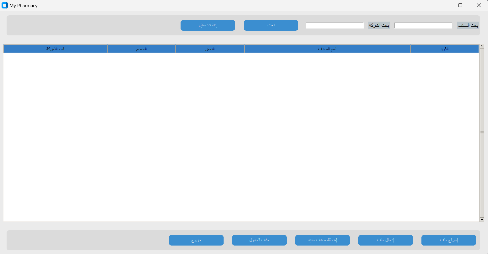
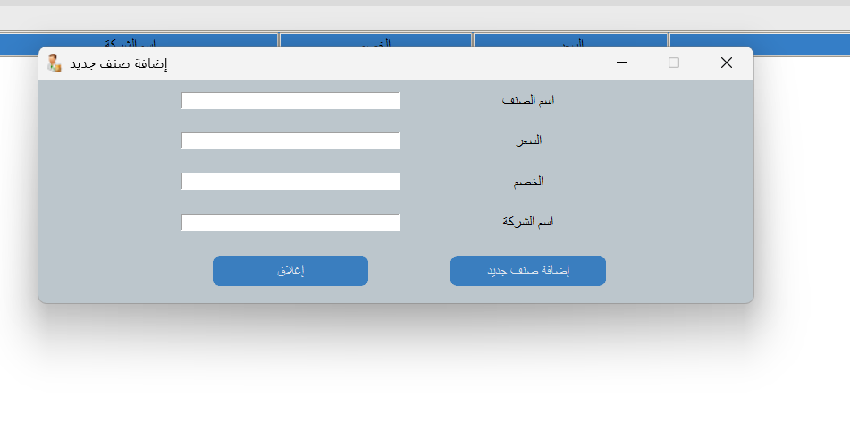

## Pharmacy Management System

This project is a Pharmacy Management System implemented using the Python programming language and the Tkinter library for the graphical user interface. It provides a user-friendly interface for managing the inventory of a pharmacy, including features such as adding new items, updating existing items, searching for items by name or company, and exporting/importing data from/to Excel files.

### Installation

Before running the application, make sure you have the required libraries installed. You can install them using pip:

```shell
pip install tkinter
pip install customtkinter
pip install mysql-connector-python
pip install pandas
pip install xlsxwriter
```

In addition, you need to install "DB Browser (SQLite)" to connect to the SQLite database.

### Getting Started

To start the application, run the following command:

```shell
python main.py
```

### Features

- **Search**: You can search for items by their name or company. Simply enter the search criteria and click the "Search" button.

- **Add Item**: To add a new item, click the "Add New Item" button and fill in the required information (item name, price, sale, and company). Then click the "Add" button.

- **Update Item**: To update an existing item, select the item from the list and click the "Update Item" button. A new window will appear with the item details. Modify the information and click the "Update" button to save the changes.

- **Delete Item**: To delete an item, select it from the list and click the "Delete Item" button. A confirmation message will appear before deleting the item.

- **Export/Import Data**: You can export the data to an Excel file by clicking the "Export" button. Similarly, you can import data from an Excel file by clicking the "Import" button.

- **Clear**: To clear any actions or search criteria, click the "Clear" button.

- **Refresh**: Click the "Refresh" button to update the data if any changes occur in the database from external sources.

- **Exit**: To close the application, click the "Exit" button.

### Home Page:


### Add New Item:

### Note
Make sure you have the appropriate permissions to perform database operations (add, update, delete) based on your user role.

### Requirements

- Python 3.6+
- tkinter library
- customtkinter library
- mysql-connector-python library
- pandas library
- xlsxwriter library
- "DB Browser (SQLite)" for managing the SQLite database

### Solve coustom tkinter when change python to .exe:
python -m PyInstaller --clean --noconfirm --onefile  --windowed --add-data "c:\users\lenovo\appdata\local\packages\pythonsoftwarefoundation.python.3 10_qbz5n2kfra8p0\localcache\local-packages\python310\site-packages/customtkinter;customtkinter/" -i "img.ico" -n "My Pharmacy" "main.py" 


